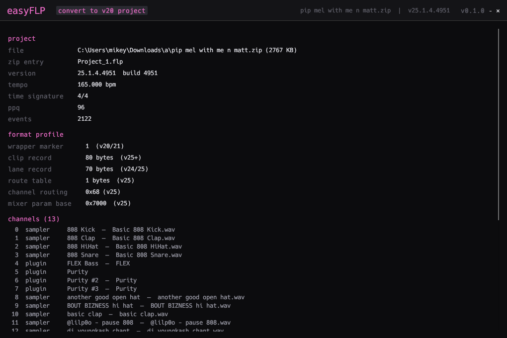
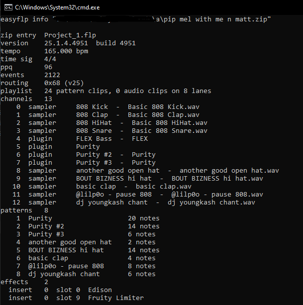

# easyFLP

a `.flp` viewer & backport utility for 🥭 version `20.0.5` *(2018)*

this is a **work in progress** project, and may have bugs.

## how to use

1. run `build_and_run.bat` (builds, kills previous process, runs)
2. drop a `.flp` or `.zip` containing a FLP file onto the box, or click it to open file explorer
3. if you want to convert the project, click the **convert to v20 project** button
4. the **⚠ convert to v10 project** button writes a `10.0.9` project instead. this profile is experimental: inserts above 99, effect slots 9-10, send levels, clip fades and plugin states newer than FL 10 do not survive. read the warnings it prints.

the converted file is written next to the input project as `<name>_easy.flp` (`<name>_easy10.flp` for the v10 profile). for a `.zip` looped package, the output is `<name>_easy.zip` with the converted `.flp` and all other files unchanged.

<p align="center">
  
</p>

## build

1. install Rust from https://rustup.rs
2. run `build.bat` or `build_and_run.bat` on windows, `build.sh` or `build_and_run.sh` on linux, or `cargo build --release` on mac.

## cli

the app is cli, but also bundles a basic GUI .exe for people to use too. usage:

```
easyflp info <file.flp|file.zip>       print project information
easyflp convert <file.flp|file.zip>    write <name>_easy (v20.0.5) next to the input
easyflp convert --fl10 <file>          write <name>_easy10 (v10.0.9) — experimental
easyflp gui [file]                     launch the graphical viewer
```

<p align="center">
  
</p>

## how it works

the converter rewrites the event stream to the byte-verified *20.0.5* profile. it runs in two stages: the *20.8* transform first, then the *20.8* to *20.0.5* post-pass. it does not touch note data, plugin states, or sample references. see [FORMAT.md](FORMAT.md) for the full transform tables and their research.

tldr:
- rewrites the version to `20.0.5.681` specifically
- convert *25* channel routing (`0x68`) to the *20* form (`0x16`)
- rewrites playlist clip records to the *20* layout
- truncates lane and channel records to the *20.0.5* lengths and drops the wrapper host chunk

the v10 profile runs the *20.8* transform first, then rewrites the stream into the *10.0.9* layout: ANSI strings, the 105-strip mixer with its four send buses, 32-byte clips on lanes `99 - track`, 8 effect slots, and FL 10's wrapper/native plugin state versions. the legacy fruity effects (blood overdrive, reeverb, phaser, chorus, balance) are re-wrapped as the VST DLLs FL 10 ships. see [FORMAT.md](FORMAT.md) for the table.

## contributing

the best way is to differentiate two `.flp` files by first creating one in version *20.8* of the program, and then opening that **same project** in version *25* or newer of the program (or your version of choice). doing this and saving both projects as `.flp` will allow you to do research of both files. 

if you are using AI to assist you, or a AI agent doing this yourself, read the **AGENTS.md** file on how to contribute to the reverse engineering more in depth with context. opcodes may need more research in the future in order to show more information or convert stuff properly backwards if you see any bugs/problems.
